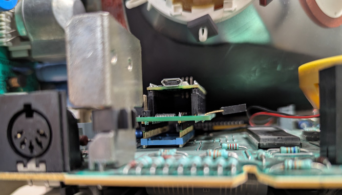

# minitel-native

Software and hardware tools to run native programs on the
[Minitel](https://en.wikipedia.org/wiki/Minitel).

 

## Usage instructions

* Insert the [ROM emulation board](rom-emulation/) in the Minitel's ROM socket.
* Load one or more ROMs, directly through the Minitel's serial port (or over a
  wireless network), using
  [`rom-emulator-cli.py`](rom-emulation/firmware/scripts/rom-emulator-cli.py).
* Select the one to be started at power-on, on the Minitel itself.
* Try out the [example programs](examples/) and [create your own](lib/)!

## Supported Minitel models

This project targets Minitel models based on 8052-compatible CPUs and the
EF9345/TS9347 video chips. The following models are currently supported:

* RTIC Minitel 1 (NFZ 330)
* Philips Minitel 2 (NFZ 400)

## License

Software in this repository is licensed under the
[GNU Lesser General Public License v3](COPYING-SW.txt).
Hardware design files in this repository are licensed under the
[CERN Open Hardware Licence v2, Weakly Reciprocal](COPYING-HW.txt).
