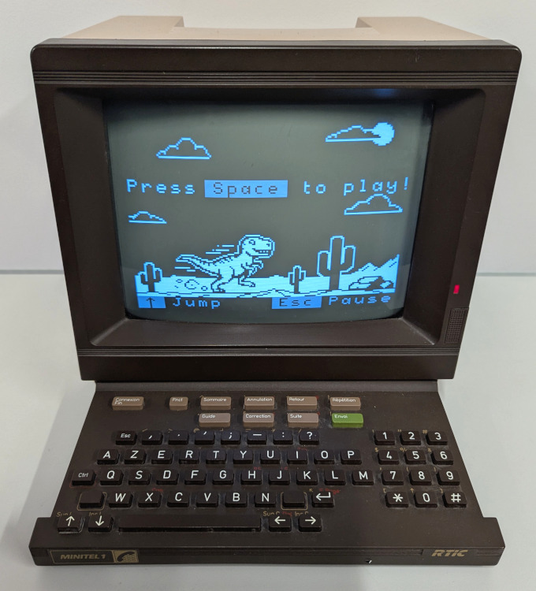
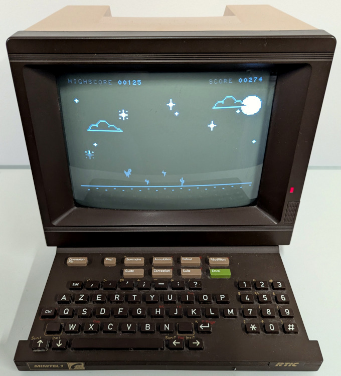
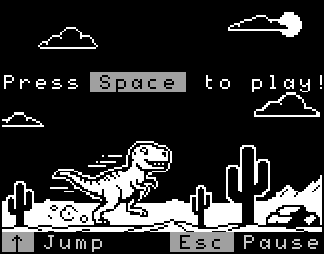
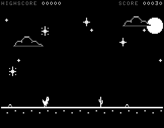
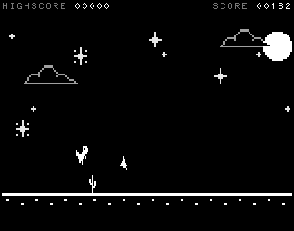
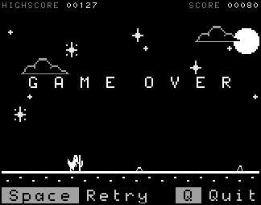
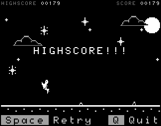
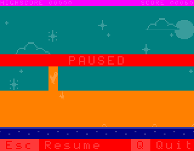
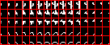
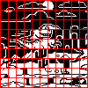

# Dino game

This program is a recreation of Chrome's famous Easter egg (`chrome://dino`).

It's a sidescroller game featuring a running dinosaur that has to jump to dodge
the obstacles on its path. The further Dino travels, the faster it will run
towards the obstacles. The player only has one control: making the dino jump. If
the dino does not jump in time and ends up touching any of the obstacles, it's
game over!

## Online demo, video and screenshots

Online demo: [https://jyaif.itch.io/dino](https://jyaif.itch.io/dino)

YouTube Video:
[https://www.youtube.com/watch?v=h29Anf6Bfy0](https://www.youtube.com/watch?v=h29Anf6Bfy0)

## Controls

Splashscreen:
| Key      | Action                                    |
|----------|-------------------------------------------|
| Space    | Start the game                            |

While playing:
| Key      | Action                                    |
|----------|-------------------------------------------|
| Up arrow | Jump                                      |
| Esc      | Pause game                                |

In pause:
| Key      | Action                                    |
|----------|-------------------------------------------|
| Esc      | Resume game                               |
| Q        | Quit game and go back to the splashscreen |

## Implementation

### Video mode and refresh rate

The game runs in 40 columns long mode, with bit 7 of the `MAT` register (*Double
height*) set.

In this mode, the screen is organized as a 40x13 grid of 8x10 tiles, in which
all the rows except the top one (the one in which the score is shown) are
doubled in height by emitting each horizontal scanline twice (leading to a total
of 320x250 pixels). On top of that, some tiles are drawn with the `L` attribute
bit (*Double width*), which doubles their horizontal size too by emitting each
pixel twice. Therefore, in all the rows except the top row, each 8x10 tile is
effectively rendered as 8x20 pixels (or even 16x20, if the `L` attribute bit is
set).

The set of the possible tiles consists of the video chip's built-in *G0* font,
which the game uses to render text, and the custom *G'0* font, which the game
uses to display graphical items.

The combined scaling effect given by the global *Double height* bit and the
per-tile *Double width* attribute is used by the game to reduce the number of
necessary custom *G'0* tiles, which is limited to 100 by the video chip's
architecture, and the amount of memory operations needed to update the screen.

The game loop, which includes both logic updates and rendering, waits for the
VSYNC pulse before each iteration and, therefore, runs at the same rate as the
screen's refresh rate.

### Score

The top row shows the current score, which increases while playing, and the
highscore. In order to avoid expensive conversions from binary to decimal at
rendering time, the score is stored as a 5-digit Binary-Coded Decimal (BCD)
number.

### Static, dynamic, floor and text areas

The 12 rows below the top row are where the action takes place. Their tiles are
logically subdivided in four groups:
* The *static area*, containing tiles that never change while playing (i.e.
  background scenery). This area is drawn only once at game loading time.
* The *dynamic area*, where the dino and the obstacles (called "enemies" in the
  source code) might be. This area is entirely redrawn at every frame.
* The *floor area* is the row of tiles depicting the floor's horizontal line and
  the dirt below. It is also updated at every frame with some tricks to
  drastically reduce the number of I/O operations.
* The *text area*, containing text that is only visible at the end of the game
  (e.g. "GAME OVER") or while in pause.

This picture shows what parts of the screen belong to each area:

#### Static area

The static area is organized as a set of *G'0* tiles. Larger items, such as
clouds, consist of several adjacent 8x10 tiles. This image shows all the defined
tiles:

When rendered on the screen, these tiles are drawn with the *Double width*
attribute bit set. Therefore, the final screen size of each tile becomes 16x20
pixels.

#### Dynamic area

The dynamic area is also organized as a set of *G'0* tiles. The items in this
area (dino, cactus, pterodactyl and rocks) move **one pixel at a time**, i.e.
with sub-tile resolution. Given that the video chip's can only display tiles
aligned to the grid, the game preloads in video RAM all the possible horizontal
shifts of each item as distinct *G'0* characters. Dynamic area's tiles are
rendered in *Double height*, due to the global setting, but without the *Double
width* attribute. Thus, their pixels are not square.

Given that items are 8 pixels wide, all the possible shifts are representable in
15 tiles (7 left-shifts, 1 unaltered and 7 right shifts):

Lastly, unlike the items in the table above, the dino shifts vertically and its
tiles might partially contain items too. For instance, if the dino is jumping
very close to a cactus, it is possible for part of the dino and part of the
cactus to end up inside the same tile. For this reason, the dino's possible
shifts are not preloaded. Instead, the tiles in the dino area are redrawn at
pixel level at every frame.

The code that takes into account possible intersections with items' tiles and
draws the dino tiles is also responsible for detecting collisions. A collision
happens when the dino tile contains both the dino and an item *in the same
pixel*. In this case, unless the intersection happened with a rock, it's game
over!

#### Floor area

The floor area consists of only 4 custom *G'0* characters instantiated
repeatedly on the screen to fill the whole horizontal space.

At every frame, only two scanlines of each *G'0* character are updated, for a
total of only 8 memory operations.

### Splashscreen

The splashsceen consists of a grid of tiles, either from the *G0* (text) or the
*G'0* (custom graphical tiles) character set. All the tiles are rendered in
*Double height*, due to the global setting, and with the per-tile *Double width*
attribute set, in fact leading to an effective screen layout of 20x12 tiles of
16x20 pixels each (excluding the top row, which is left blank).

The image is rendered using only 99 *G'0* tiles. The uniform tiles are rendered
as *G0* blank characters.

## Credits

**Artwork**: Jean-François Geyelin, Maria Glukhova

**Programming**: Fabio D'Urso, Jean-François Geyelin
