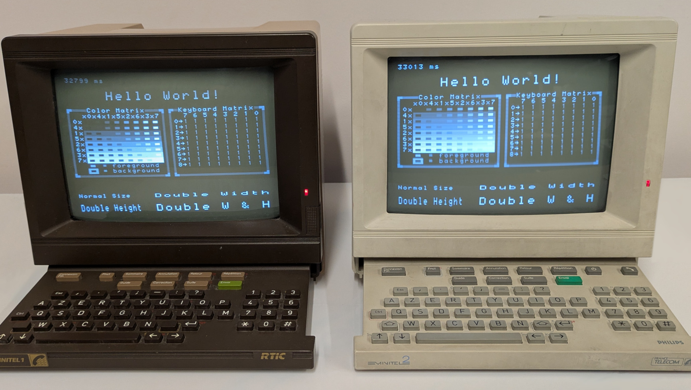
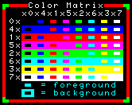

# Hello World

<p align="center">

</p>

This program shows on screen the keyboard state and the time since boot, as well
as a number of fixed elements (flashing "Hello World" text, color matrix and
samples of the four possible text sizes).

## Color matrix

<p align="center">


</p>

The images above show the color matrix, as it would be rendered by color and
grayscale Minitels.

Its cells show the background and foreground colors resulting from the given `A`
byte in EF9345/TS9347's 40-character long mode.

For instance, given the row representing red (`1x`) and the column representing
yellow (`x3`), their intersection shows the result of rendering yellow-on-red
(whose `A` value, obtained by combining them, is thus hexadecimal value `13`).

The correspondence between grayscale levels and colors is fixed: all grayscale 
Minitels and all color Minitels use the palettes shown above.

## Keyboard

In most Minitel models, the keyboard state will be displayed as a matrix of `0`
or `1` values. The 722039 M, instead, displays it as a stream of bytes.

### Keyboard Matrix

<p align="center">

</p>

The Minitel's keyboard is made of many keys. In order to reduce the number of
wires between the keyboard and the logic board, the keys are organized as a
[keyboard matrix](https://en.wikipedia.org/wiki/Keyboard_matrix_circuit).

This program shows the raw logic value of each cell in the keyboard matrix and,
when a key is pressed, its name at the bottom (a string starting with `KEY_`,
the same identifier used by the `minitel_keyboard` library).

### Keyboard Stream

<p align="center">

</p>

In the 722039 M, the keyboard is connected to an auxiliary microcontroller,
connected to the main CPU via an internal serial port. In this model, the
program shows the raw bytes as they arrive from the auxiliary microcontroller.

The name of the last pressed key is shown at the bottom, along with an optional
extra letter if a modifier key is pressed (`S` for Shift, `C` for Control, `F`
for Function).

## Text sizes

<p align="center">

</p>

Text can be rendered in four different sizes by the EF9345/TS9347:
* **Normal Size** (`B` byte set to hexadecimal value `07`).
* **Double Width** (`B` byte set to hexadecimal value `27`).
* **Double Height** (`B` byte set to hexadecimal value `17`).
* **Double Width and Height** (`B` byte set to hexadecimal value `37`).

In the dimensions that are doubled, the corresponding character and attributes
must be doubled in video memory too:
* A double-width `A` must be stored twice like this
  ```
  AA
  ```
* A double-height `A` must be stored twice like this
  ```
  A
  A
  ```
* A double-width-and-height `A` must be stored four times like this
  ```
  AA
  AA
  ```
