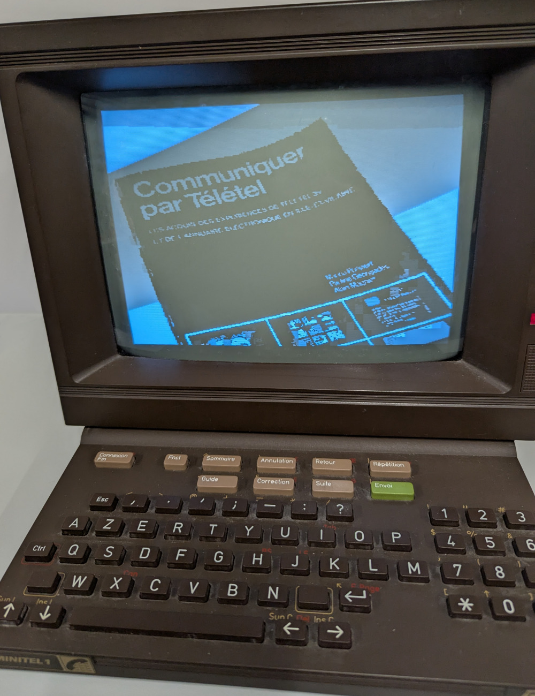
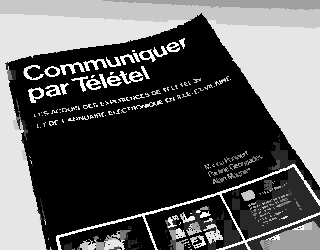

# Image Gallery

This example program displays arbitrary images, using the video chip's
capability to define custom fonts and mosaic characters.

## Build-time preprocessing

At build-time, the [generate-image-tiles.py](scripts/generate-image-tiles.py)
script takes an input image and splits it into a 40x25 grid of tiles. A new font
is then generated on the fly, which defines 40x25=1000 custom glyphs, each
corresponding 1:1 to a tile.

Ideally, the contents of the screen could then simply be populated with a
sequence of never-repeating glyphs, each showing its own tile at the proper
position. Unfortunately, the Minitel's video chip only has space for 300 custom
glyphs. Therefore, some repetitions are unavoidable.

The script's tiling algorithm works by starting from this ideal condition, and
then repeatedly replacing one glyph with just a reference to another glyph that
looks visually similar. Every iteration reduces the number of custom glyphs by
one, at the cost of replacing the real contents of a tile with a
similarly-looking, but not identical, one.

The algorithm stops when the number of custom glyphs reaches 300, which fit in
the Minitel's video chip.

In addition to generating the custom glyphs, the script also:
* Optionally dithers the input image (useful for photorealistic images).
* Normalizes each tile, i.e. it assigns each tile a background and foreground
  color in a way that makes the glyph more likely to be reusable.
* When applicable, directly replaces tiles with symbols from the mosaic
  character set. Mosaic glyphs are built-in to the video chip, and thus do not
  count towards the 300 custom glyph limit.

## The Minitel program

The Minitel program embeds an image in the form of the outputs of the script:
* The pixel contents of each glyph in the custom font.
* The 40x25 grid of references to those glyphs (or mosaic characters), along
  with the respective foreground and background colors.

The program stores nine such images, which can be selected with next/previous
and the numeric keys on the keyboard.

Every time the selection changes from one image to the other, the video chip's
screen contents and custom font definition are overridden. Since this process
is not instantaneous, the screen is refreshed on the CRT several times while
the update is in progress. Therefore, it is possible to see the changes "live",
as they are happening!

## Credits

Tiling algorithm jointly formulated by [@fabio-d](https://github.com/fabio-d)
and [@jyaif](https://github.com/jyaif).

The example images were sourced from the following pages:
* `image1.png`: https://www.museeminitel.fr/24231945_2064407823573057_852360205611450028_n/
* `image2.png`: https://www.museeminitel.fr/2018/09/les-imprimantes-videotex/img_8648r-2/
* `image3.png`: https://www.museeminitel.fr/img_5415/
* `image4.png`: https://www.museeminitel.fr/22140853_1978683185478855_3979619214637225312_n/
* `image5.png`-`image9.png`: https://forum.museeminitel.fr/t/mon-voyage-du-06-11-21-mutzig/811

Some of those images have been slightly tweaked to enhance the rendering result.
