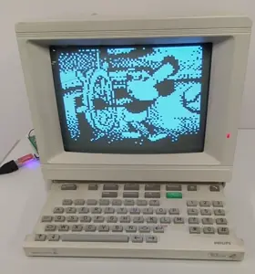

# Video Stream

<p align="center">

</p>

This Minitel program receives and immediately displays 80x75 monochromatic
images. The images are received through the serial port at a much higher baud
rate than the usual Minitel speeds (e.g. 115200 for the Minitel 2).

The images consist of a 40x25 grid of mosaic characters (G10 charset). Each
mosaic character contains 2x3 tiles, that can be individually set to white or
black.

The companion [send-video-frames.py](scripts/send-video-frames.py) script:
1. takes an animated image in input (e.g. a GIF)
2. dithers and turns its frames into mosaic characters
3. lastly, streams them to the Minitel in a loop.

The baud rate (and, as a consequence, the number of frames per second) is
different depending on the Minitel model. The [CMakeLists.txt](CMakeLists.txt)
contains the highest rates that were experimentally found to be working in the
different supported models.

## Quick start

Connect the Minitel's serial port to the computer and launch the ROM. Then, run
the following command on the computer:
```shell
# Adjust the baud rate according to your Minitel model (see CMakeLists.txt)
$ python3 scripts/send-video-frames.py \
    --serial-port /dev/ttyUSB0 \
    --baud-rate 115200 \
    steamboat.gif
```
