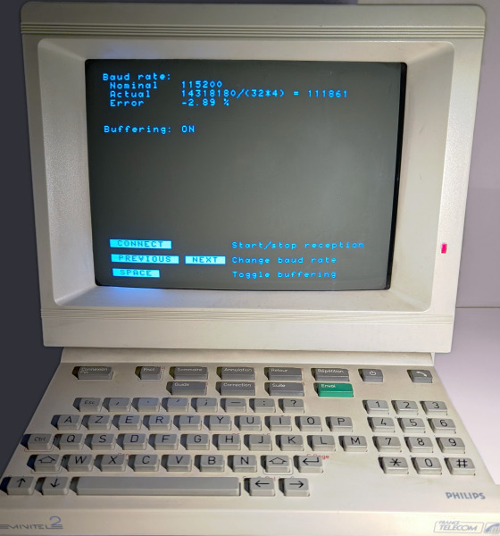
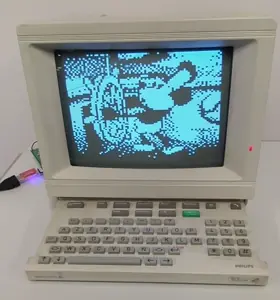

# Video Stream

<p align="center">


</p>

This Minitel program receives and immediately displays 80x75 monochromatic
images. The images are received through the serial port at a much higher baud
rate than the usual Minitel speeds (e.g. 115200 for the Minitel 2).

The images consist of a 40x25 grid of mosaic characters (G10 charset). Each
mosaic character contains 2x3 tiles, that can be individually set to white or
black.

The companion [send-video-frames.py](scripts/send-video-frames.py) script:
1. takes an animated image in input (e.g. a GIF)
2. dithers and turns its frames into mosaic characters
3. lastly, streams them to the Minitel in a loop.

## Baud rate selection

The following table shows the fastest transfer rates that were attained in each
tested Minitel model. Try lower baud rates and/or more stop bits if experiencing
data corruption.

| Model                    | FPS  | Command line arguments             |
|--------------------------|-----:|------------------------------------|
| RTIC Minitel 1           |  9.5 | `--baud-rate 115200 --stop-bits 3` |
| Philips Minitel 2        | 11.3 | `--baud-rate 115200 --stop-bits 1` |
| Telic-Alcatel Minitel 12 |  7.6 | `--baud-rate 76800 --stop-bits 1`  |

## Quick start

Connect the Minitel's serial port to the computer and launch the ROM. Then, run
the following command on the computer:
```shell
# Replace "--baud-rate 115200" and "--stop-bits 1" with the actual values.
$ python3 scripts/send-video-frames.py \
    --serial-port /dev/ttyUSB0 \
    --baud-rate 115200 \
    --stop-bits 1 \
    steamboat.gif
```
