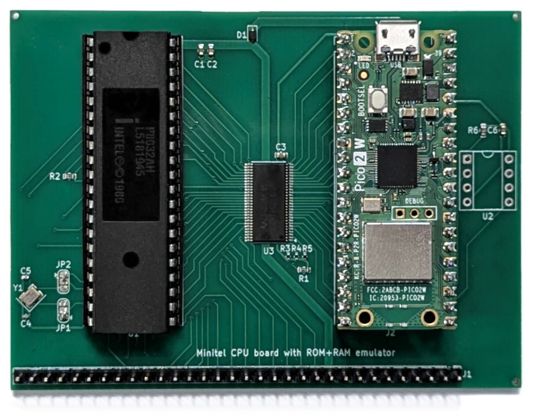
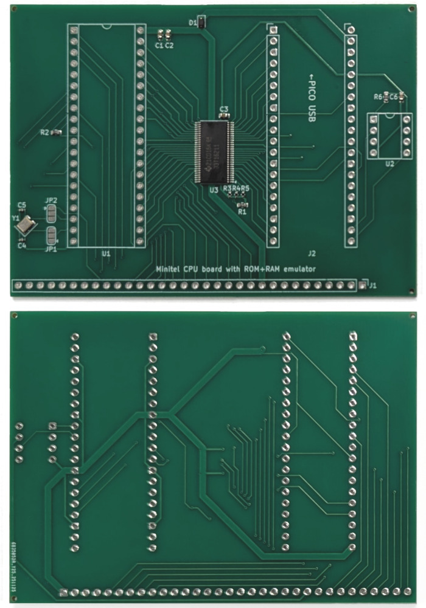
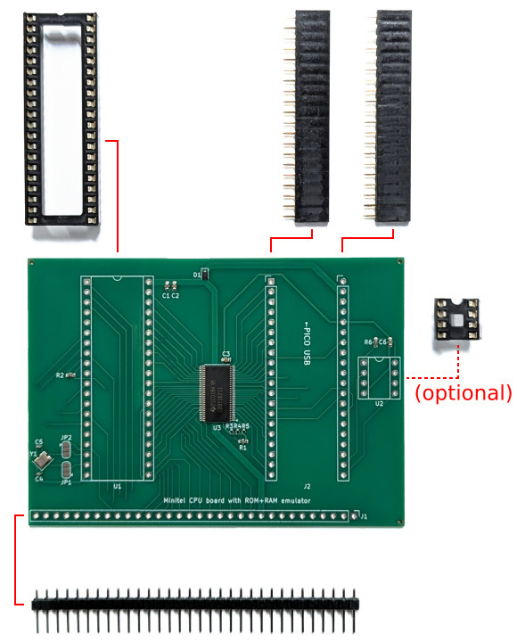
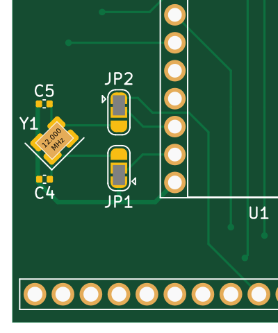
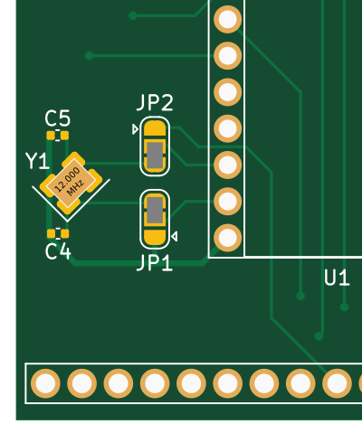
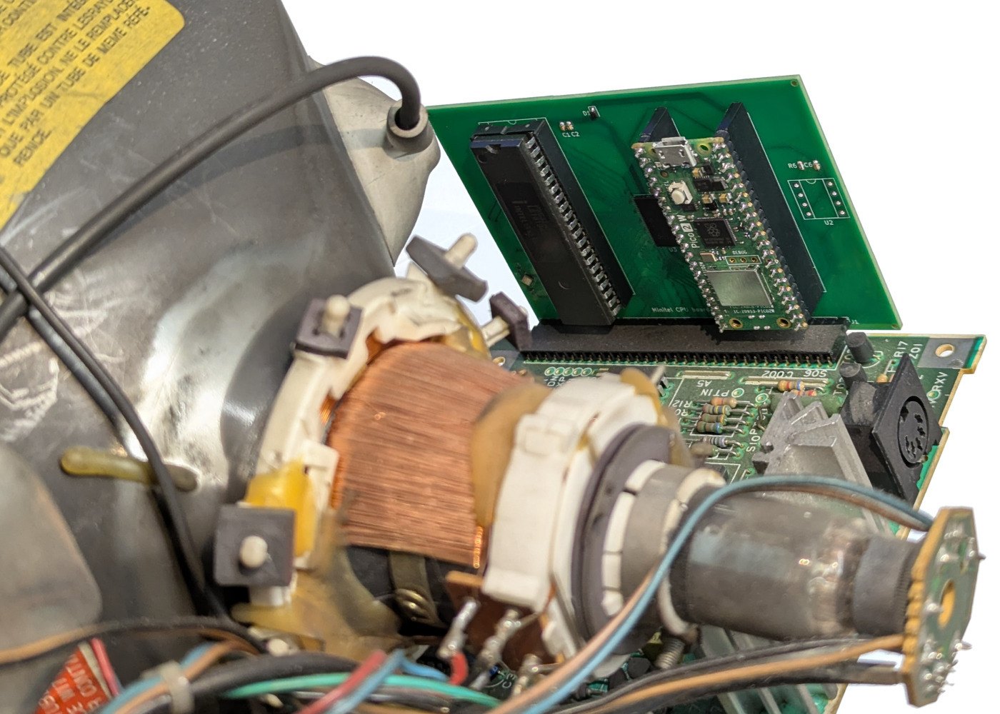
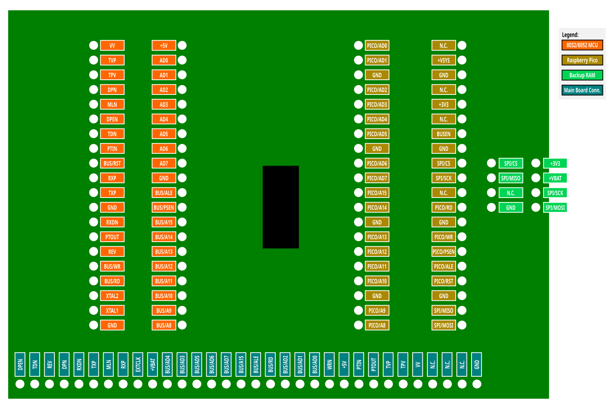

# Adapter board for 722039 M Minitels

This board supports the following Minitel models:

* Telic-Alcatel Minitel 12 (722039 M)

**Note**: the battery[^1]-powered RAM chip is optional. If omitted (or if no
batteries are installed), the Minitel will lose its address book and messages at
every boot.

[^1]: The Minitel 12's battery slot is located under the display (two 1.5V AA)
and easily accessible without disassembling. See page 4 of the
[Minitel 12 manual](https://www.minitel-alcatel.fr/documents/M12_1988/M12%20%20Mode%20d'emploi.pdf).

## Bill of materials

* Surface mounted (included in the production files for PCB fabrication):
  * **U3**: SN74CB3T16211 Bus Switch TSSOP
    ([datasheet](https://www.ti.com/lit/gpn/SN74CB3T16211),
    [LCSC/JLCPCB](https://jlcpcb.com/partdetail/C2653275)).
  * **Y1**: 12 MHz Crystal
    ([LCSC/JLCPCB](https://jlcpcb.com/partdetail/C9002)).
  * **D1**: 1N5819 Schottky diode SOD-323
    ([LCSC/JLCPCB](https://jlcpcb.com/partdetail/C191023)).
  * **C1, C3**: 1 &micro;F Capacitor 0603
    ([LCSC/JLCPCB](https://jlcpcb.com/partdetail/C15849)).
  * **C2, C6**: 100 nF Capacitor 0603
    ([LCSC/JLCPCB](https://jlcpcb.com/partdetail/C14663)).
  * **C4, C5**: 30 pF Capacitor 0402
    ([LCSC/JLCPCB](https://jlcpcb.com/partdetail/C1570)).
  * **R1, R2, R6**: 8.2 k&ohm; Resistor 0603
    ([LCSC/JLCPCB](https://jlcpcb.com/partdetail/C25981)).
  * **R3, R4, R5**: 22 k&ohm; Resistor 0402
    ([LCSC/JLCPCB](https://jlcpcb.com/partdetail/C25768)).
* Others (to be purchased and assembled separately):
  * Raspberry Pico 2 or Raspberry Pico 2 W
    ([RP2350 datasheet](https://datasheets.raspberrypi.com/rp2350/rp2350-datasheet.pdf),
    [Pico 2 datasheet](https://datasheets.raspberrypi.com/pico/pico-2-datasheet.pdf),
    [Pico 2 W datasheet](https://datasheets.raspberrypi.com/picow/pico-2-w-datasheet.pdf)).
  * P8032AH microcontroller in DIP package
    ([AliExpress](https://www.aliexpress.com/item/1005003690963062.html)).
  * 40-pin DIP socket
    ([AliExpress](https://www.aliexpress.com/item/1005006256010892.html)).
  * Two 20-pin female headers
    ([AliExpress](https://www.aliexpress.com/item/32854239374.html)).
  * One 32-pin male header
    ([AliExpress](https://www.aliexpress.com/item/1005006034877497.html)), or a
    longer one cut accordingly.
* And, optionally, for battery-powered RAM support:
  * 23LCV512 SPI RAM in PDIP package
    ([datasheet](https://ww1.microchip.com/downloads/en/devicedoc/25157a.pdf)).
  * 8-pin DIP socket
    ([AliExpress](https://www.aliexpress.com/item/1005006256010892.html)).

## Assembling the board

Solder the headers as shown in the pictures and populate the sockets with the
corresponding chips.

Use solder to close bridges JP1 and JP2 in one of the ways shown below,
depending on the clock configuration of the Minitel's original CPU board:

<table>
  <tr>
    <td align="center">
       
      Position 1-1: 
      Use external clock
    </td>
    <td align="center">
       
      Position 3-3: 
      Use on-board clock
    </td>
  </tr>
</table>

Choose position 3-3 only if the original CPU board has a crystal on it (see
[example pictures](https://commons.wikimedia.org/wiki/File:Crystal_Packages.jpg)
for what it looks like - note that it might be horizontal rather than vertical
too). If no crystal is present in the original CPU board, choose position 1-1.

## Installation

> [!TIP]
> Some of the original design documents for this Minitel have been published at
> [this page](https://www.minitel-alcatel.fr/M12.html). The "M12 Description
> Technique 1988" file has a picture of the internal boards at page 18 and the
> original schematics at the end. The "Hardware M12" document has revised
> schematics that seem to better match the actual circuits in my Minitel.

Installation is straightforward: pull the original CPU board out of the main
board and replace it with the new board.

## Schematic

## Pinout

