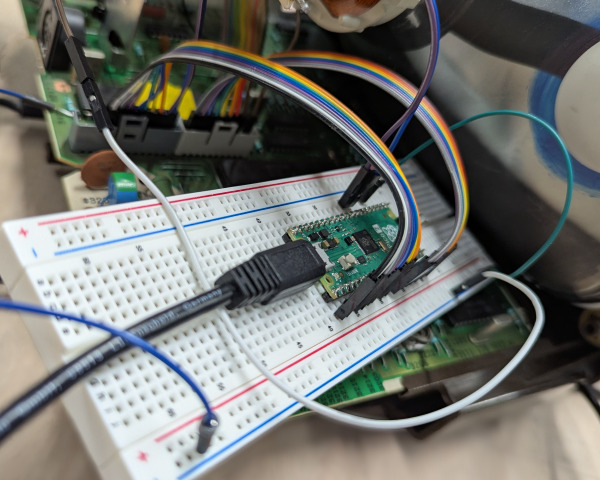
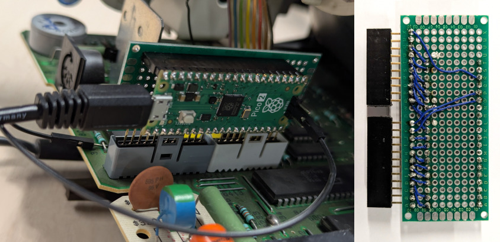

# Generic Do-It-Yourself adapter board

If you don't have the dedicated adapter PCB for your specific Minitel model at
hand, you might be able to hand-solder one yourself, or even just connect the
Minitel's ROM socket directly to the Pico 2's GPIO pins with jumper wires, like
in these examples:

<p align="center">

<br />

</p>

This page shows how to connect the Pico without a dedicated PCB and the caveats
to be aware of.

# Connections

## Identifying the ROM socket's pinout

Let's start by identifying the CPU of the Minitel, a 40-pin DIP chip
identifiable by its etched label, likely to be some variation of "8032" or
"8052". Using the notch on the top side as a reference, let's take a look at its
pinout:

<p align="center">

</p>

Now, let's identify the ROM socket on the Minitel's logic board. It is likely to
be either an unpopulated socket/connector (if the CPU is an 8052, which has an
integrated ROM), or a socket with a ROM chip/daughterboard inserted.

Using a multimeter in continuity mode, verify that the ROM socket exposes the
following CPU pins and write down their position:
* From `P0.0/AD0` to `P0.7/AD7`
* From `P2.0/A8` to `P2.7/A15`
* `ALE/PROG`
* `PSEN`
* `VSS` (i.e. GND)

Once the socket has been identified, remove the old ROM.

## Connecting the Pico 2 or Pico 2 W

On the Pico side, the `P0.0/AD0`-`P0.7/AD7` and `P2.0/A8`-`P2.7/A15` pins must
be connected to GPIOs 0-15, `ALE/PROG` to GPIO 19 and `PSEN` to GPIO 20. At
least one of the Pico's GND must be tied to the Minitel's `VSS`.

It is possible to connect AD0-7 and A8-15 to GPIOs 0-15 in any order, provided
the constraints described in
[scripts/generate-pin-map.py](../firmware/scripts/generate-pin-map.py) are met.

The following table shows an example of a valid mapping. If you are planning to
deviate from it, try building the Pico firmware with the corresponding
`justrom:` string first (see
[Building the firmware and flashing a ROM](#building-the-firmware-and-flashing-a-rom)
below), to validate the intended design. The build will fail if the constraints
are not met.

| Minitel CPU side | Pico 2 side |
|------------------|-------------|
| `P2.0/A8`        | GPIO 0      |
| `P2.1/A9`        | GPIO 1      |
| `P2.2/A10`       | GPIO 2      |
| `P2.3/A11`       | GPIO 3      |
| `P2.4/A12`       | GPIO 4      |
| `P2.5/A13`       | GPIO 5      |
| `P2.6/A14`       | GPIO 6      |
| `P2.7/A15`       | GPIO 7      |
| `P0.7/AD7`       | GPIO 8      |
| `P0.6/AD6`       | GPIO 9      |
| `P0.5/AD5`       | GPIO 10     |
| `P0.4/AD4`       | GPIO 11     |
| `P0.3/AD3`       | GPIO 12     |
| `P0.2/AD2`       | GPIO 13     |
| `P0.1/AD1`       | GPIO 14     |
| `P0.0/AD0`       | GPIO 15     |
| `ALE/PROG`       | GPIO 19     |
| `PSEN`           | GPIO 20     |
| `VSS`            | GND        |

The connection method (direct wires, breadboard or hand-soldered board) depends
on the Minitel socket type and what kind of material is available to you.

Do NOT connect the Minitel's 5 V power rail (`VCC`) to the Pico: we will power
it over USB instead (see [Power on sequence](#power-on-sequence) for details).

## Bypassing to the integrated ROM (8052 only)

If the Minitel CPU is an 8052, which has an integrated ROM, it will boot:
* From the integrated ROM if `EA/VPP` is externally driven high.
* From the external ROM (i.e. the Pico-emulated one, ignoring the internal one)
  if `EA/VPP` is externally driven low.

You will have to ensure that the CPU reads a low value on `EA/VPP`. If the
Minitel model is supported by an adapter board, you might find more information
in the corresponding adapter board's directory. If not, you are on your own: if
`EA/VPP` connected to 5 V, you will have to disconnect it and connect GND
instead. Please report back if you find ways to do it in other Minitel models!

# Operating instructions

## Building the firmware and flashing a ROM

Write down the all the lines that are connected to the Pico's GPIOs 0-15, in
order, separated by commas. This will be used for the `justrom:` string in the
`cmake` command line. For instance, if the connections were made in accordance
to the table above, the string will be
`justrom:A8,A9,A10,A11,A12,A13,A14,A15,AD7,AD6,AD5,AD4,AD3,AD2,AD1,AD0`.

Build the firmware with `OPERATING_MODE=embedded` and `MINITEL_MODEL` set to the
string we just constructed. The other parameters (including, notably, the path
to the Minitel ROM to be emulated) can be customized as needed:
```shell
# Run these commands in the "../firmware" directory.
$ mkdir build/
$ cd build/

$ cmake .. \
    -DPICO_SDK_PATH=~/pico-sdk \
    -DPICO_BOARD=<pico2|pico2_w> \
    -DMINITEL_MODEL=justrom:A8,A9,A10,A11,A12,A13,A14,A15,AD7,AD6,AD5,AD4,AD3,AD2,AD1,AD0 \
    -DOPERATING_MODE=embedded \
    -DEMBED_ROM_FILE=/path/to/rom.bin

$ make
```

Once built, connect the Pico's USB port to the computer while keeping the
`BOOTSEL` button pressed, and a new virtual disk drive will appear to be
connected. Copy `build/rom-emulator-embedded.uf2` into it.

For details, refer to the [firmware's README](../firmware/README.md) file.

## Power on sequence

> [!CAUTION]
> Do not power the Minitel unless the Pico is already powered from USB!
> Similarly, do not disconnect the USB cable while the Minitel is still on.

There are two reasons why the Minitel's 5 V rail (`VCC`) must NOT be connected
to the Pico. One is that, unless an extra diode is added, the power from the USB
bus would leak into the Minitel's logic board and back-feed into the Minitel's
own power distribution system. The other one is that, even if we added the extra
diode, there would be no functional advantage in letting the Minitel power the
board.

One might think that, if the Minitel powered the Pico and the Pico has been
flashed with a ROM to emulate, the system could run standalone with our DIY
board, without the need for a USB connection. Unfortunately, no. In fact,
dedicated adapter boards have extra hardware to make this possible, that our DIY
board does not have.

There would be two issues with letting the Pico be powered by the Minitel
itself, one with timing and one with voltage levels.

The timing issue is that the Pico takes much longer to boot than it takes for
the Minitel to start fetching from the ROM. Therefore, if we powered both at the
same time, the Minitel's CPU would start expecting the ROM to be ready while
it's not yet.

The voltage issue - **and this is the most important one to remember** - is that
[the Pico's GPIO lines are only 5 V tolerant while its 3.3 V rail is powered](https://forums.raspberrypi.com/viewtopic.php?t=375118). The Minitel's CPU will drive the Pico's GPIO lines
to 5 V whenever it wants to emit a high value. Therefore, it is important to
ensure the Pico's internal 3.3 V regulation is already stable **before**
powering on the Minitel.

In conclusion:
* Always power the Pico first, from its USB port, so that its 3.3 V power supply
  stabilizes. Only then plug the Minitel's power cord.
* Power off in reverse order: unplug the Minitel's power first. Then disconnect
  the Pico's USB cable.
