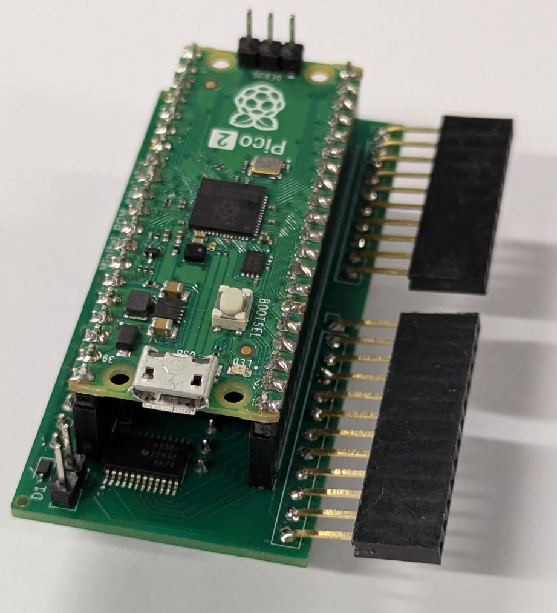
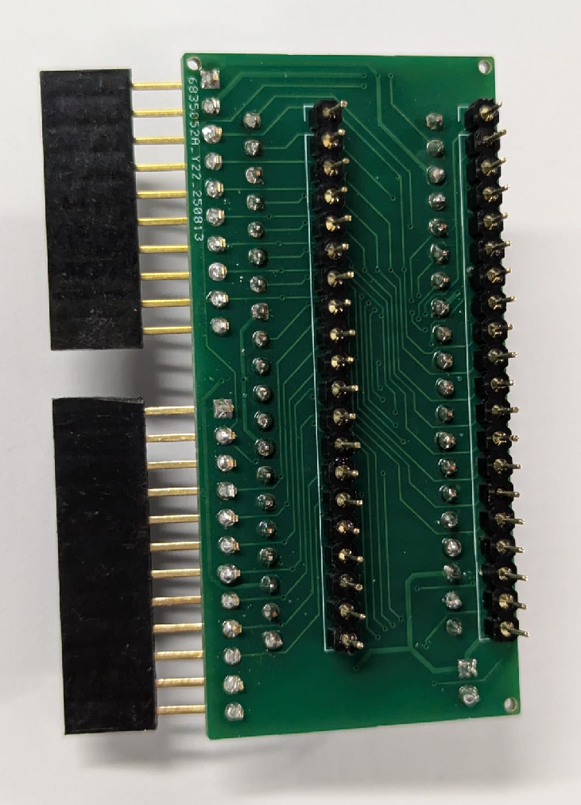
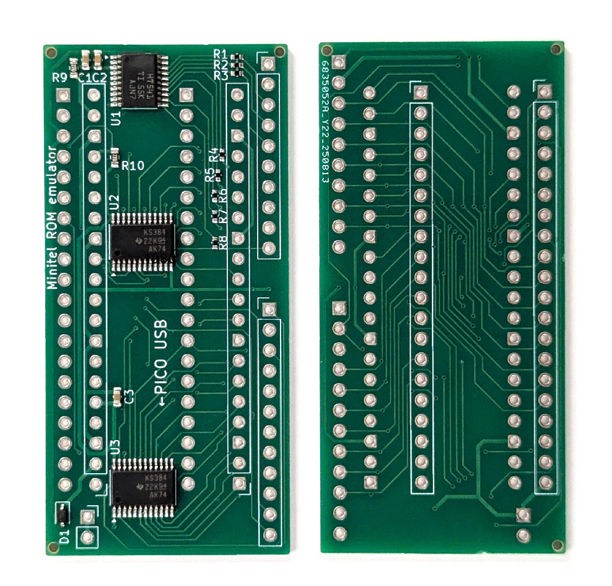
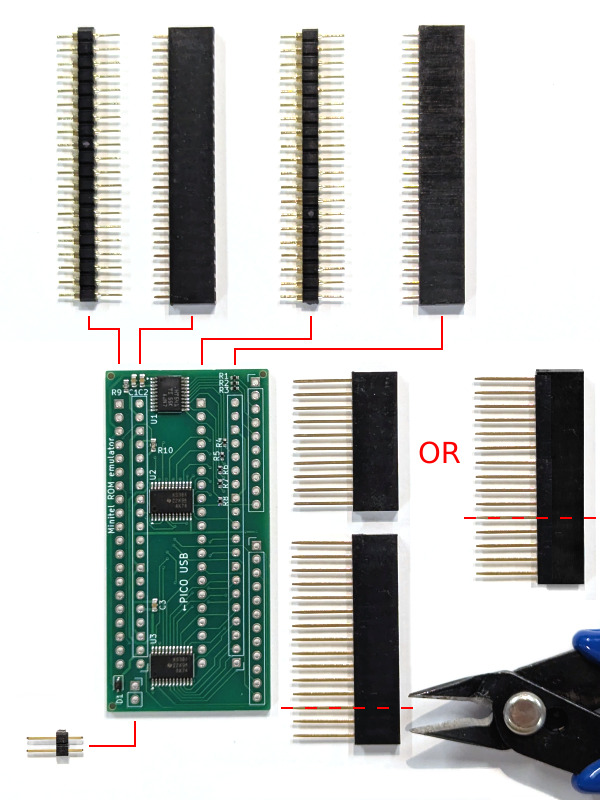
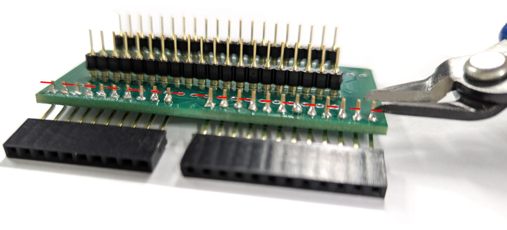
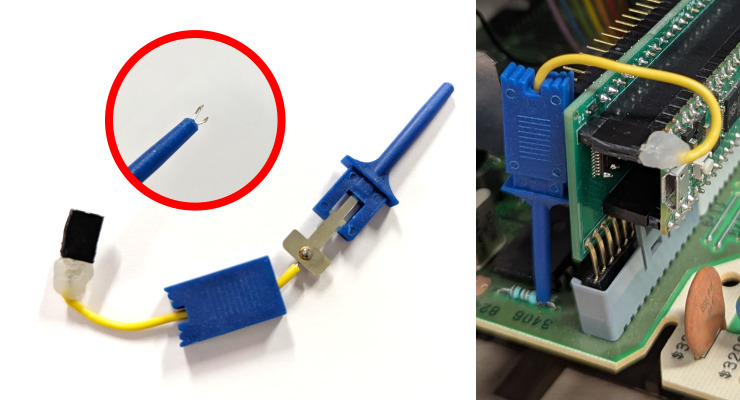
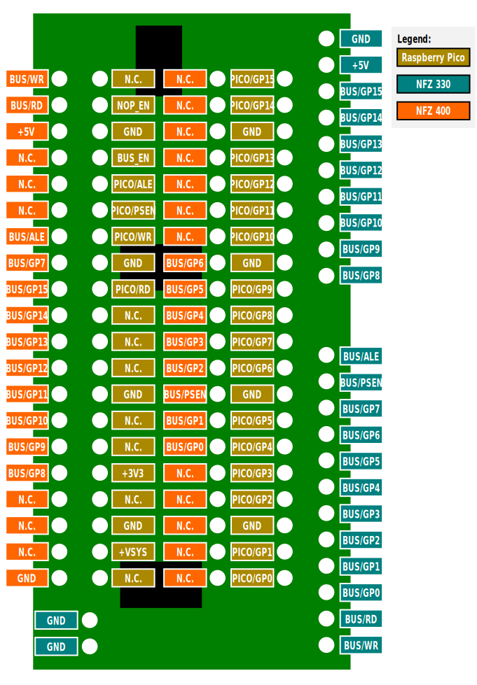

# Adapter board for NFZ 330 and NFZ 400 Minitels

This board supports the following Minitel models:

* RTIC Minitel 1 (NFZ 330)
* Philips Minitel 2 (NFZ 400, NMS 6202/19B and NMS 6202/19W)
* HOBS Viewdata Banking Terminal (NMS 6302/00B)

## Bill of materials

* Surface mounted (included in the production files for PCB fabrication):
  * **U1**: SN74HCT541 Octal Buffer TSSOP
    ([datasheet](https://www.ti.com/lit/gpn/SN74HCT541),
    [LCSC/JLCPCB](https://jlcpcb.com/partdetail/C436096)).
  * **U2, U3**: SN74CB3T3384 Bus Switch TSSOP
    ([datasheet](https://www.ti.com/lit/gpn/SN74CB3T3384),
    [LCSC/JLCPCB](https://jlcpcb.com/partdetail/C139357)).
  * **D1**: 1N5819 Schottky diode SOD-323
    ([LCSC/JLCPCB](https://jlcpcb.com/partdetail/C191023)).
  * **C1, C3**: 1 &micro;F Capacitor 0603
    ([LCSC/JLCPCB](https://jlcpcb.com/partdetail/C15849)).
  * **C2**: 100 nF Capacitor 0603
    ([LCSC/JLCPCB](https://jlcpcb.com/partdetail/C14663)).
  * **R1, R2, R3, R4, R5, R6, R7, R8**: 1.5 k&ohm; Resistor 0402
    ([LCSC/JLCPCB](https://jlcpcb.com/partdetail/C25867)).
  * **R9, R10**: 8.2 k&ohm; Resistor 0603
    ([LCSC/JLCPCB](https://jlcpcb.com/partdetail/C25981)).
* Others (to be purchased and assembled separately):
  * Raspberry Pico 2 or Raspberry Pico 2 W
    ([RP2350 datasheet](https://datasheets.raspberrypi.com/rp2350/rp2350-datasheet.pdf),
    [Pico 2 datasheet](https://datasheets.raspberrypi.com/pico/pico-2-datasheet.pdf),
    [Pico 2 W datasheet](https://datasheets.raspberrypi.com/picow/pico-2-w-datasheet.pdf)).
  * Two 20-pin female headers
    ([AliExpress](https://www.aliexpress.com/item/32854239374.html)).
  * (ROMless NFZ 330 only) One 2-pin male header
    ([AliExpress](https://www.aliexpress.com/item/1005006034877497.html)), or a
    longer one cut accordingly.
  * (NFZ 330 only) Tall female headers (with bendable legs), either one 10-pin
    and one 15-pin or two 15-pin headers
    ([AliExpress](https://www.aliexpress.com/item/1005007077965713.html)), cut
    accordingly.
  * (NFZ 400 only) Round hole headers, either two 20p
    ([AliExpress](https://www.aliexpress.com/item/1005007563971977.html)), or
    one 40p to be cut in half.

## Assembling the board

Solder the headers as shown in the pictures.

The tall headers, which are necessary for the NFZ 330 only, must be bent towards
the side. The remaining excess length of the legs can be trimmed away with a
cutter. The 2-pin header is only for NFZ 330, too.

The round hole headers are only necessary for the NFZ 400.

## Installation

### RTIC Minitel 1 (NFZ 330)

> [!TIP]
> Pictures of this Minitel model can be found at
> [this page](http://hxc2001.free.fr/yaquoidedans/Minitel-RTIC-Minitel9-NFZ330/index.html)
> by HxC2001. The pinout of the ROM slot has been documented
> [in this post](https://forum.system-cfg.com/viewtopic.php?p=243591#p243591).

If the Minitel originally had a ROM board inserted in the ROM slot, simply
replace it with the new board.

If the Minitel did not have a ROM board (i.e. it would normally boot from the
8052's integrated ROM and the external ROM slot was unpopulated), it is
necessary to also drive the CPU's External Access (EA) pin (#30) to GND. This
can be done with the following DIY cable:

Material:
* One 2-pin female header
  ([AliExpress](https://www.aliexpress.com/item/32854239374.html)), or a longer
  one cut accordingly.
* Grabber probe
  ([AliExpress](https://www.aliexpress.com/item/1005006975901107.html)).
* Wire, to be soldered to both pins on the header side and then hot-glued to
  make it stronger. The probe side must be soldered too.

The probe needs to be attached to the resistor on the Minitel's logic board as
shown in the picture. **Explanation**: the logic board's resistor is a pull-up
that would drive EA high, thus selecting the integrated ROM. By connecting it to
GND (exposed on both adapter board's pins, see the [Pinout](#pinout) below), EA
is driven low, thus selecting the external ROM. The reason why this cable is not
needed in Minitels that originally came with external ROMs is that their
resistor was soldered in the factory in a slightly different position, which
makes it act as a pull-down rather than a pull-up.

### Philips Minitel 2 (NFZ 400, NMS 6202/19B and NMS 6202/19W)

> [!TIP]
> The internals of this Minitel model have been extensively documented in the
> [main page](http://hxc2001.free.fr/minitel/index.html) of HxC2001's analysis.
> The pinout of the ROM socket has been documented
> [in this post](https://forum.system-cfg.com/viewtopic.php?p=249020#p249020)
> (the pinout is shown on the right-hand side with the "slot EPROM Minitel"
> label and it is mirrored left/right).

Installation is straightforward: after removing the old ROM, insert the board in
the proper orientation. It takes a moderate amount of force to push the pins
fully inside the socket.

It is probably a good idea to temporarily extract the Minitel's logic board and
perform the operation on a flat rigid surface, to avoid flexing it while
pushing.

### HOBS Viewdata Banking Terminal (NMS 6302/00B)

Remove the whole expansion board that is present in the socket in which the
NFZ 400 would have just a ROM chip. Then, follow the same instructions as the
NFZ 400.

## Schematic

## Pinout

