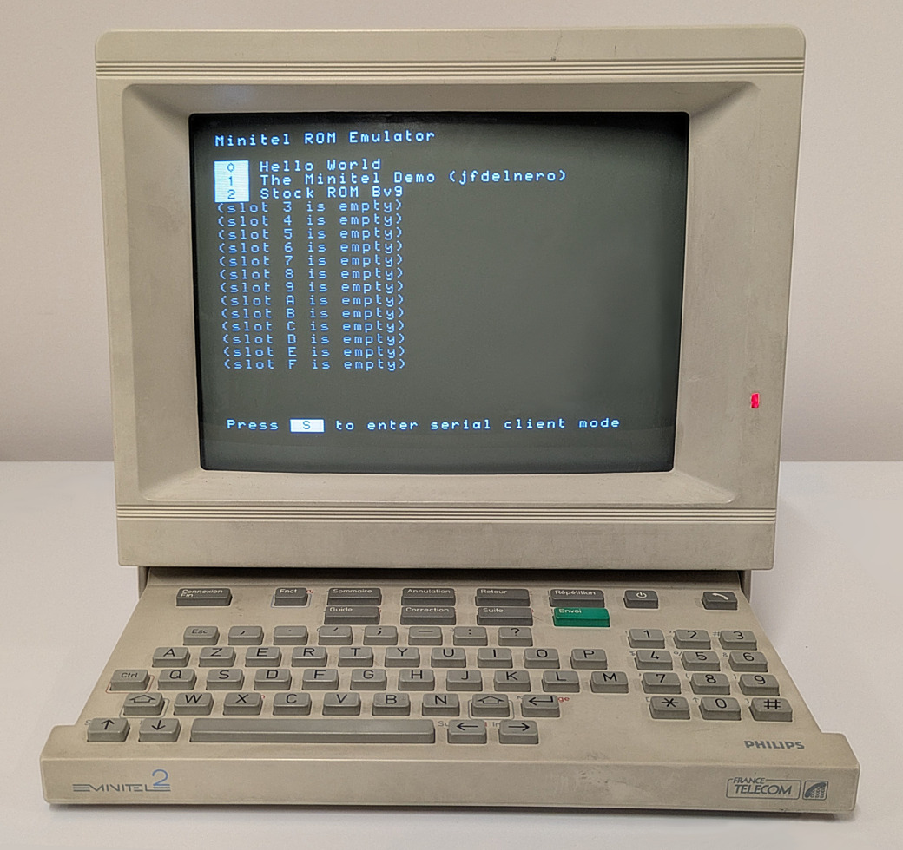

# Firmware for the ROM Emulation board

<p align="center">

</p>

## Building from source

Download the Pico SDK (tested with version 2.2.0) and the other prerequisites:
```shell
$ sudo apt install build-essential cmake gcc-arm-none-eabi \
    libnewlib-arm-none-eabi libstdc++-arm-none-eabi-newlib python3 sdcc

# The SDK can be downloaded into any directory. The next commands assume that
# it has been cloned into the home directory and, therefore, the resulting
# path is ~/pico-sdk.
$ git clone https://github.com/raspberrypi/pico-sdk.git --branch 2.2.0 \
    --recurse-submodules
```

Configure and build the project:
```shell
# Run these commands in the "firmware" directory (same as this README.md file).
$ mkdir build/
$ cd build/

# Omit -DEMBED_ROM_FILE=... if -DOPERATING_MODE=interactive.
$ cmake .. \
    -DPICO_SDK_PATH=~/pico-sdk \
    -DPICO_BOARD=<pico2|pico2_w> \
    -DMINITEL_MODEL=<nfz330|nfz400|justrom:...> \
    -DOPERATING_MODE=<embedded|interactive> \
    -DEMBED_ROM_FILE=/path/to/rom.bin

$ make
```
where:
* `PICO_BOARD` is the Pico board model that will run the ROM emulation software.
* `MINITEL_MODEL` is the Minitel model that the ROM emulator will be used with:
  * `nfz330`: RTIC Minitel 1 in conjuction with `board_nfz330_nfz400`.
  * `nfz400`: Philips Minitel 2 in conjuction with `board_nfz330_nfz400`.
  * There is also some limited support for custom hardware boards and/or other
    Minitels: it is possible to pass `justrom:` followed by a comma-separated
    list of names of bus lanes connected to GPIOs from 0 to 15. See the
    [generate-pin-map.py](scripts/generate-pin-map.py) script for details.
* `OPERATING_MODE` selects what level of features should be enabled:
  * If set to `embedded`, `EMBED_ROM_FILE` should be set to path to the ROM file
    to be emulated. No other features, in addition to just serving the ROM, will
    be enabled.
  * If set to `interactive`, up to 16 different ROMs can be stored, and the
    Minitel shows an interactive menu on its screen at power on. Using the
    Minitel's keyboard, it is possible to either proceed to booting one of the
    stored ROMs or to enter _serial client mode_ (see
    [Client protocol](#client-protocol) below).

## Installation

### If `OPERATING_MODE` is `embedded`

Connect the Pico's USB port to the computer while keeping the `BOOTSEL` button
pressed, and a new virtual disk drive will appear to be connected. Copy
`build/rom-emulator-embedded.uf2` into it. The disk drive will disconnect at the
end of the process and the Pico's on-board LED will start to blink, indicating
that the ROM emulation software is running.

### If `OPERATING_MODE` is `interactive`

> [!WARNING]
> In interactive mode, the Pico's internal flash will be partitioned (as opposed
> to being unpartitioned, which is how most Pico programs normally run). If,
> after installing this firmware, the Pico board needs to be later reused in
> other projects, use the `flash_nuke.uf2` program (see
> [official instructions](https://www.raspberrypi.com/documentation/microcontrollers/pico-series.html#resetting-flash-memory))
> to fully revert this process and restore factory conditions.

Connect the Pico's USB port to the computer while keeping the `BOOTSEL` button
pressed, and a new virtual disk drive will appear to be connected. Copy
`build/rom-emulator-full-install.uf2` into it. The disk drive will disconnect at
the end of the process and the Pico's on-board LED will start to blink,
indicating that the ROM emulation software is running.

The most practical way to load ROMs into flash memory is via the
[Client protocol](#client-protocol)'s `store` command. **As an alternative**,
after installing `build/rom-emulator-full-install.uf2`, it is also possible to
preload the whole catalog of ROMs in bulk, with the help of the `picotool`
program and the `generate-data-partition.py` script:
```shell
# First step: Create a data partition image containing the desired ROMs.
# Use options from --slot0 to --slotF to optionally populate each of the 16
# boot options ("slots"). The slots are identified by an hex digit ("SLOT_ID"),
# that is, in order: 0, 1, 2, 3, 4, 5, 6, 7, 8, 9, A, B, C, D, E and F.
# For each ROM, it is necessary to pass the path and the title that will be
# displayed in the menu.
$ scripts/generate-data-partition.py \
    --slot0 /path/to/hello_world.bin "Hello World" \
    --slot1 /path/to/another_rom.bin "Another ROM" \
    --slotF /path/to/yet_another_rom.bin "This ROM is stored in the last slot" \
    --output data_part.bin

# Second step: Flash the resulting image into the data partition.
# Power the board while BOOTSEL is pressed, then:
$ picotool load -p 2 data_part.bin  # note: -p 2 selects the "DATA" partition
```

Similarly, after installing `build/rom-emulator-full-install.uf2`, subsequent
firmware updates can be loaded without erasing the ROM in the data partition,
by powering the board with BOOTSEL pressed and dragging
`build/rom-emulator-update-only.uf2` into its virtual disk drive.

## Client protocol

The [`scripts/rom-emulator-cli.py`](scripts/rom-emulator-cli.py) program can be
used to interact with the firmware while it is running on the Pico.

It supports the following connection channels:
* The Pico's own USB serial port (usage: `rom-emulator-cli.py -s /dev/ttyACM0`).
* The Minitel's "p&eacute;ri-informatique" port (`interactive` mode only; usage:
  select _serial client mode_ in the menu first, and then use
  `rom-emulator-cli.py -s /dev/ttyUSB0` on the computer, provided the Minitel is
  connected as described [here](https://pila.fr/wordpress/?p=361)).

Always available commands:
* `ping`: verifies that the Pico program is responding.
* `trace`: prints the most recent ROM addresses fetched by the Minitel's CPU.

Only if `OPERATING_MODE` is `interactive`:
* `boot -n SLOT_ID`: equivalent to choosing to boot the ROM at `SLOT_ID` from
  the interactive menu.
* `store -n SLOT_ID [-l "Description for the menu"] [-b] rom.bin`: stores a new
  ROM (or replaces the existing one) at `SLOT_ID`. Unless overridden by the
  optional `-l` argument, the ROM's filename will be shown in the boot menu as
  the description for the ROM. The optional `-b` flag automatically boots the
  just-stored ROM at the end of the transfer.
